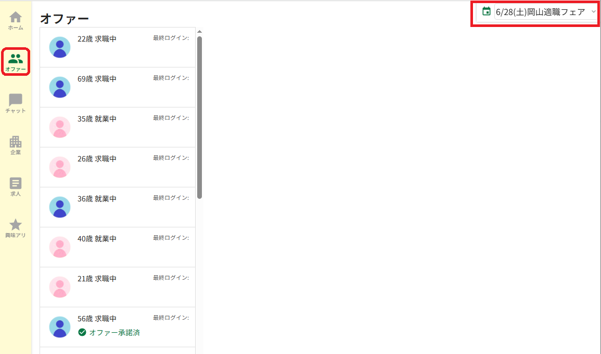

# オファーの送信

イベントが当日や事前に求職者に「オファー」を送信することが出来ます。

オファーを送信すると、求職者のホーム画面にあなたの企業からオファーが送信されたということが表示されます。

求職者がオファーを承認すると、その求職者の電話番号・メールアドレス・氏名を閲覧することが出来るようになり、アプリ内のチャット機能でやりとりをすることができます。

### 「オファー」タブを開く

<figure><figcaption></figcaption></figure>

「オファー」タブを開きます。また、右上のイベント選択項目が、参加予定のイベントになっていることを確認します。


右上のイベントが選択できない場合、オファーの有効期間が切れている可能性があります。オファーはイベント終了後14日間まで行うことが出来ます


